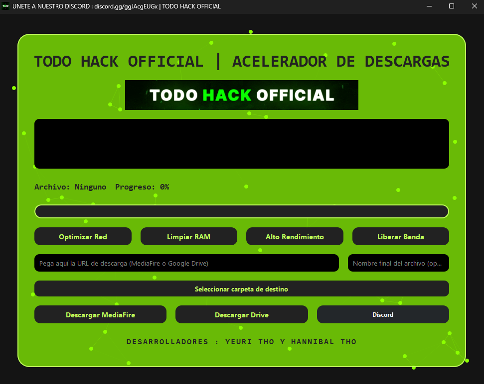

# THO ACELERADOR DE DESCARGA 🚀



## Descripción
Aplicación de escritorio para Windows que permite optimizar la red, limpiar la RAM, activar el modo de alto rendimiento y descargar archivos desde MediaFire y Google Drive de forma sencilla.

## Requisitos

- Python 3.8 o superior
- pip

## Instalación

1. Clona o descarga este repositorio.
2. Instala las dependencias ejecutando en la terminal:

   ```
   pip install -r requeriments.txt
   ```

3. Ejecuta la aplicación:

   ```
   python main.py
   ```

## Uso

- Usa los botones para optimizar la red, limpiar la RAM o activar el modo de alto rendimiento.
- Pega el enlace de MediaFire o Google Drive y elige el nombre del archivo (opcional).
- Selecciona la carpeta de destino si lo deseas.
- Haz clic en el botón correspondiente para descargar.

## Comunidad

¿Dudas o sugerencias? Únete a nuestro Discord:  
[https://discord.gg/ggJAcgEUGx](https://discord.gg/ggJAcgEUGx)

## Notas

- Solo compatible con Windows.
- Se recomienda ejecutar como administrador para ciertas funciones del sistema.
